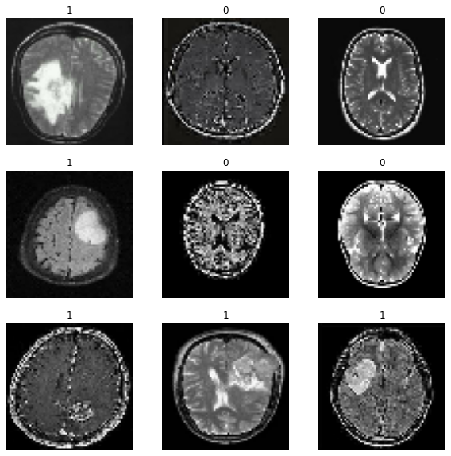

# Brain-Tumor-Classification

In this project, I tried to implement a simple convolutional neural network for a brain tumor classification task. The dataset consists of two classes which indicate whether there is a tumor or not. 

I used TensorFlow and Keras libraries to implement my network and implement it with both sequential and functional approaches. 

Here is a smaple of datasest:

